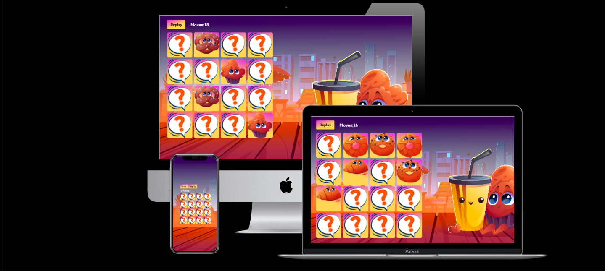

# Sweet Memory
Sweet Memory is a web application that allows user to get part in the memory game where you can improve your memory skills by guessing two identical cards on the board.

## Description
This game was created by using HTML, CSS and Javascript languages. The main page will provide you a game board with sixteens cards showing a question mark on it. By clicking on each card user will flip the card to another side with specific picture. The idia is to find another one card with exectly same picture on it. Once you find all pairs of card game can be counted as done. That will be a great fun for children as well as for adults. 

## Existing Features

- __Start Button__
    - You can start the game only by pressing on this button. 
    - By pressing on this button the game started and the button disappear.
- __Replay Button__
    - By pressing on this button you can restart the game at any time.
- __Moves Counter__
    - Will show you how many clicks you did to achieve the result.

# Testing
  - I tested this website working with different browsers such as Google Chrome, Mozilla Firefox, Opera.
  - I confirm that this project is responsive and looks good on smartphones, tablets and desktops.

# Unfixed Bugs
- The application doesn't work properly on the iOS devices as the CSS "transform" rule done in a different way on iOS then on other systems. Unfortunately I didn't solve the issue as of yet.

## Validator Testing 

- HTML
  - No errors were returned when passing through the official [W3C validator](https://validator.w3.org/nu/?doc=https%3A%2F%2Frurakite.github.io%2Fkite-lessons%2Fgallery.html)
- CSS
  - No errors were found when passing through the official [Jigsaw validator](https://jigsaw.w3.org/css-validator/validator?uri=https%3A%2F%2Frurakite.github.io%2Fkite-lessons%2Findex.html&profile=css3svg&usermedium=all&warning=1&vextwarning=&lang=ru)
- Javascript
    - No errors were found when passing through the official [Jshint validator](https://jshint.com/)
- Accessibility
  - I confirm that colors and fonts chosen are able to read and accessible by running in through lighthouse in devtools.

 # Deployment
  
  ## Version Control
- The site was created using the Visual Studio code editor and pushed to github to the remote repository ‘tacos-travels’.

- The following git commands were used throughout development to push code to the remote repo:

- git add <file> - This command was used to add the file(s) to the staging area before they are committed.

- git commit -m “commit message” - This command was used to commit changes to the local repository queue ready for the final step.

- git push - This command was used to push all committed code to the remote repository on github.

  ## Deployment to Github Pages
- The site was deployed to GitHub pages. The steps to deploy are as follows:
  - In the GitHub repository, navigate to the Settings tab
  - From the menu on left select 'Pages'
  - From the source section drop-down menu, select the Branch: main
  - Click 'Save'
  - A live link will be displayed in a green banner when published successfully.
  
  The link can be found here - [https://rurakite.github.io/sweet-memory/](https://rurakite.github.io/sweet-memories/)
